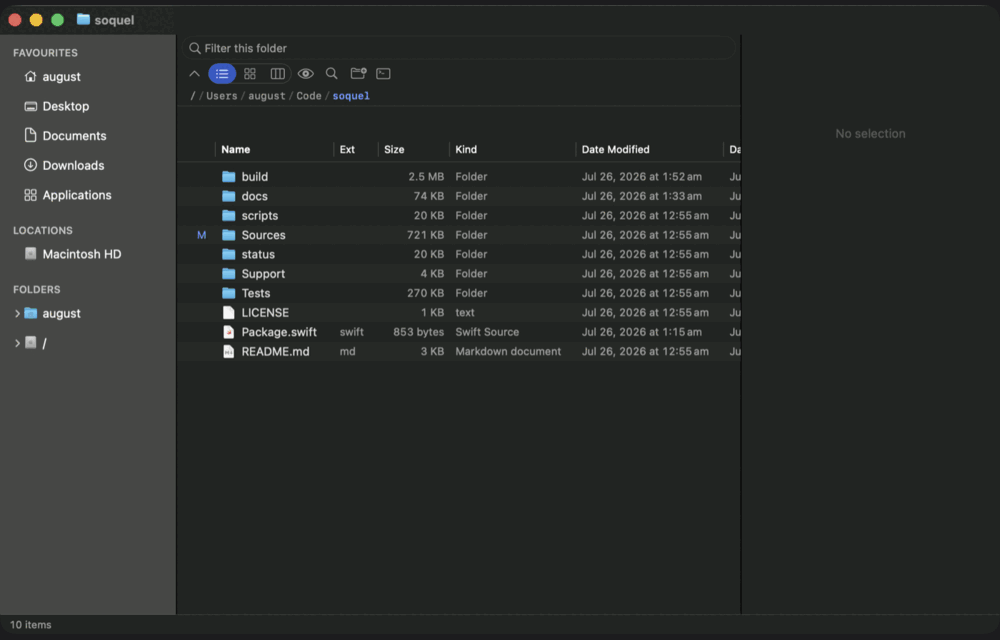

# Screenshots



| | |
| --- | --- |
| [List view](screenshots/01-list-view.png) | Sortable columns, Git status, the preview panel on the right |
| [Icon view](screenshots/02-icon-view.png) | Quick Look thumbnails, generated off the main thread and cached |
| [Column view](screenshots/03-column-view.png) | A pane per level, folders marked with a chevron |
| [Disk map](screenshots/04-disk-map.png) | `⇧⌘U` — where the space went, with the biggest items beside it |
| [Settings](screenshots/05-settings.png) | Seven colour slots for light and dark, background image and opacity |

## How these were taken

`SOQUEL_OPEN` opens a panel at launch, so a screenshot needs no clicking:

```sh
SOQUEL_OPEN=diskmap open -a /Applications/Soquel.app
```

Accepts `diskmap`, `shelf`, `transfers`, `compare`, `search`, `settings`, `server`, `palette`.
It is also the quickest way to reproduce a bug in a panel without describing six clicks first.
